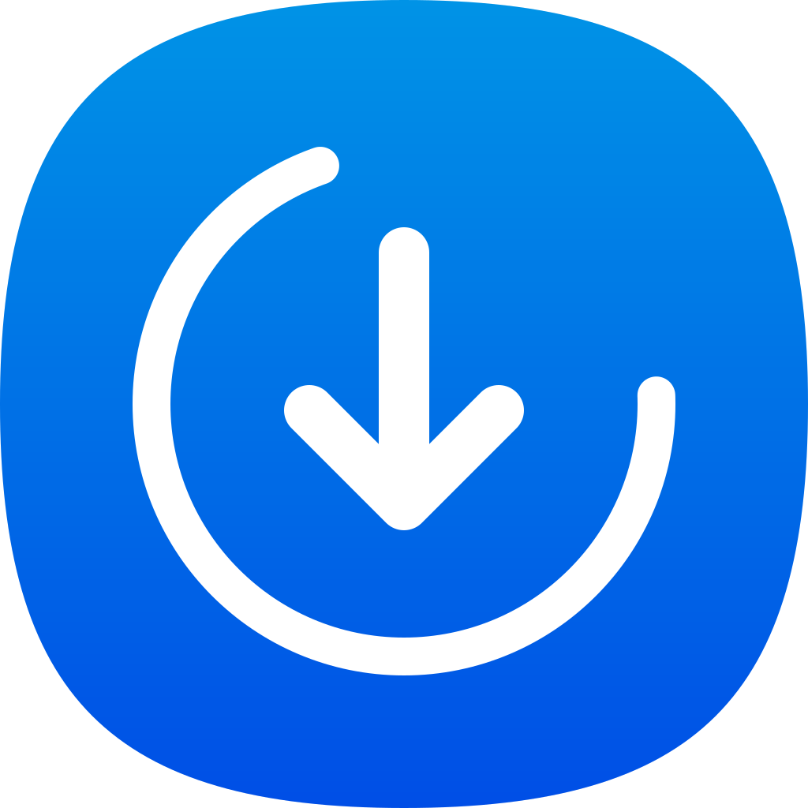

# SwiftDL

**SwiftDL** est un gestionnaire de téléchargement moderne et performant pour macOS, conçu avec **SwiftUI** et **Swift Concurrency**. Il combine la simplicité d'une interface native avec la puissance de `yt-dlp` pour offrir une expérience de téléchargement fluide, particulièrement optimisée pour YouTube et les flux directs.

<p align="center">
  
  <br>
  
  
  
</p>

## ✨ Points forts

- 📺 **Support StremIO** : Supporte le téléchargement de contenus en provenance de StremIO.
- 📺 **Support YouTube Premium** : Télécharge automatiquement la meilleure qualité disponible (1080p, 4K, 8K) en récupérant séparément les flux vidéo et audio. Fournir un url du type `https://www.youtube.com/watch?v=`.
- ⚡ **Fusion Instantanée** : Utilise `AVFoundation` (`AVMerger`) pour assembler les flux vidéo et audio sans réencodage (Remuxing), préservant 100% de la qualité originale en un clin d'œil.
- 🛠️ **Zéro Configuration** : `yt-dlp` est automatiquement téléchargé, installé et mis à jour de manière isolée dans votre dossier `Application Support`.
- 📂 **Respect du Sandbox** : Utilise les protocoles de sécurité de macOS (App Sandbox) avec gestion des permissions via les Bookmarks de fichiers.
- 🎨 **Design Natif** : Une interface moderne qui s'intègre parfaitement à macOS, avec support du mode sombre et une icône personnalisée.

## 🚀 Installation rapide

La méthode la plus simple pour installer **SwiftDL** est de générer le paquet `.app` :

1.  Clonez le dépôt :
    ```bash
    git clone https://github.com/votre-username/SwiftDL.git
    cd SwiftDL
    ```
2.  Lancez le script de packaging :
    ```bash
    ./bundle.sh
    ```
3.  Une fois terminé, déplacez **SwiftDL.app** vers votre dossier **/Applications**.

---

## 🛠 Architecture & Technologies

L'application repose sur des fondations modernes pour garantir réactivité et stabilité :

- **SwiftUI & Observation** : Pour une interface réactive et une gestion d'état simplifiée.
- **Swift Concurrency** : Utilisation intensive de `async/await` et des `Actors` pour des opérations réseau et disque non bloquantes.
- **URLSession Background** : Les téléchargements continuent même si l'interface est fermée ou si l'application est en arrière-plan.
- **BinaryManager** : Gère dynamiquement le cycle de vie des outils externes.
- **AVFoundation** : Manipulation de média de bas niveau pour la fusion de flux (MPEG-4 DASH).

## 🧩 Dépendances

- [yt-dlp](https://github.com/yt-dlp/yt-dlp) : Le moteur d'extraction de métadonnées de référence.
- [SwiftDL-Resources] : Pack de ressources incluant l'icône haute définition générée pour macOS Sonoma.

## 📄 Licence

Ce projet est distribué sous licence MIT. Consultez le fichier [LICENSE](LICENSE) pour plus d'informations.

---
*Fait avec ❤️ pour macOS.*
